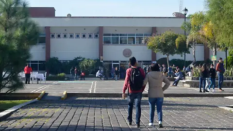

# UTM-ECOSCAN 🍃

**Monitoreo Ambiental en Tiempo Real para espacion Universitarios**

  

## Descripcion 

**UTM-ECOSCAN** es un proyecto enfocado en la medición de datos ambientales dentro de la Universidad Técnica de Morelia
Mediante el uso de tecnologías como **Arduino, sensores especializados, módulos ESP32 y una plataforma web desarrollada con React**.

## Problemática a Resolver

**Actualmente no contamos con información precisa sobre la calidad del aire que respiramos día a día dentro de la universidad.**  
Esta situación es especialmente preocupante, ya que **nos encontramos a un lado practicamente de la zona industrial de la ciudad**, lo que podría influir en los niveles de contaminación del aire en el campus.

Con **UTM-ECOSCAN** buscamos **obtener una visión más clara de las condiciones del aire** en nuestro entorno académico y, en un futuro, **concientizar a la comunidad universitaria sobre la importancia de la calidad del aire**.

## Objetivos especificos

Con este proyecto buscamos aplicar lo aprendido en nuestra carrera **(Desarrollo de software Multiplataforma)**, en una **problematica real**.
Y para llevar esto a cabo, nos hemos planteado unos **objetivos especificos**.

- Hacer buen uso de los conocimientos adquiridos en las aulas, reforzándolos mediante investigaciones, pruebas y testeos.  
- Medir de la manera más precisa y calibrada posible los datos crudos del aire.  
- Crear una interfaz y experiencia de usuario (UX) agradable, intuitiva y accesible.  
- Concientizar a la comunidad sobre la calidad del aire que respiramos.